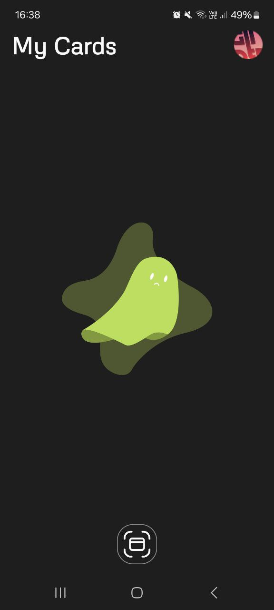
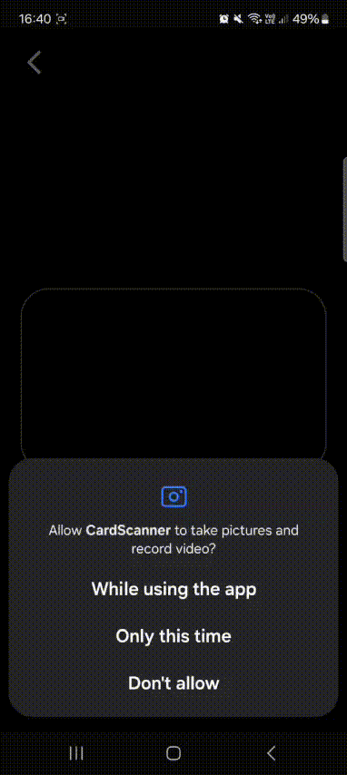

# CardScanner 📷💳

**CardScanner** is an Android application that scans bank cards using the device camera.  
The app extracts card details with **ML Kit**, saves them locally using **Room**, and observes data changes in real time with **LiveData**.

## Features
- Scan bank cards using CameraX
- Detect card number and expiration date with ML Kit
- Save scanned card data locally
- Real-time UI updates using LiveData
- Simple and user-friendly XML-based UI

## Architecture
- MVVM (Model–View–ViewModel)

## Tech Stack
- **Language:** Kotlin  
- **UI:** XML (View-based UI)  
- **Camera:** CameraX  
- **Machine Learning:** ML Kit (Text Recognition)  
- **Architecture:** MVVM  
- **Database:** Room  
- **Reactive Data:** LiveData  

## App Behavior
- Opens camera and scans a physical bank card
- Extracts card number and expiration date automatically
- Saves card information to local Room database
- Updates UI instantly when data changes via LiveData

## Project Status
Demo / learning project

## Screenshots / Demo

  
  

